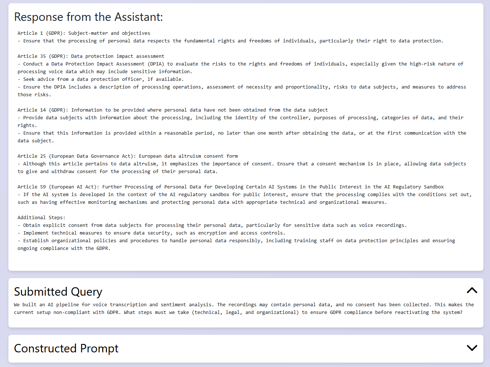

# AI LEGAL ASSISTANT

Powered by

<!--<p align="left">
  <a href="https://www.ijs.si/"></a>
</p>-->


## **General Description**

AI Legal Assistant tool is a Retrieval-Augmented Generation assistant for compliance. This codebase implements a RAG assistant focused on EU AI-related regulations. It segments the laws, builds embeddings, retrieves relevant articles, and generates answers while displaying both sources and the LLM response.

## **Commercial Information**

| Organisation (s)             | License Nature           | License |
| ---------------------------- | ------------------------ | ------- |
| Jožef Stefan Institute (JSI) | Open Source (permissive) | MIT     |

(Repo is MIT-licensed.) 

## **Top Features**

* Covers four cornerstone EU regulations: **AI Act**, **Data Act**, **Data Governance Act**, **GDPR**. 
* Retrieval with **LanceDB** + **SQLite** metadata separation for efficient search & rich display. 
* **Re-ranking** using `all-MiniLM-L6-v2` for higher precision answers. 
* **Two app modes**: public (simple) and testing (configurable model, tokens, temperature, embedding/re-ranker). 
* **Transparency UX**: shows query, retrieved articles, constructed prompt, and model response. 


## **Architecture**

**High-level flow**

1. **Ingestion & Parsing** → Scrape official regulation sites, store per-regulation JSON, split into overlapping passages with metadata (regulation, chapter, article, passage no.). 
2. **Embeddings & Storage** → Create passage embeddings (BAAI/bge-small-en), normalize, store metadata in SQLite and vectors in LanceDB. 
3. **Retrieval** → Vector similarity search in LanceDB, then re-rank pairs [query, passage] with `sentence-transformers/all-MiniLM-L6-v2`; merge passages back to full articles. 
4. **Application Layer** → FastAPI/Uvicorn web app (public & testing variants) constructs a prompt with retrieved context and calls OpenAI (default GPT-3.5-Turbo); UI shows user query, retrieved articles, prompt, and LLM answer. 

## **Component Definition**

* `data/*` — per-regulation folders with scrapers and JSON outputs (e.g., `parsing_ai_act.py`, `ai_act.json`). 
* `embed_store_data.py` — merges JSONs, computes embeddings (BAAI/bge-small-en), writes SQLite metadata and LanceDB vectors. 
* `retrieving_articles.py` — candidate retrieval via cosine similarity + re-ranking with `all-MiniLM-L6-v2`. 
* `app_public.py` / `app_testing.py` — FastAPI apps (default parameters vs. configurable testing). 
* `api_script.py`, `Dockerfile`, `package_requirements.txt`, `lancedb_files/*`, `data/*/*.db` — API helpers, containerization, dependencies, vector/SQL stores. 

## **Screenshots**




## **Expected KPIs**

| What (Types)            | How (Process)                                                                       | Values                                                                                                                                                                        |
| ---------------------------- | ------------------------------------------------------------------------------------- | ---------------------------------------------------------------------------------------------------------------------------------------------------------------------------------------- |
| Answer Relevance | Benchmark on compliance questions derived from regulatory documents | Recall@10> 0.85 |

## **How To Install**

| Project Links                                                                                    |
| ------------------------------------------------------------------------------------------------ |
| **Software GitHub Repository** → JSI ASSISTANT [lrei/legal-AI](https://github.com/lrei/legal-AI) |


### Requirements

* **Python** 3.9+
* **OpenAI API key** (required to generate model responses)
* (Optional) **Docker** Desktop for containerized run 

### Software

* Clone: `git clone https://github.com/lrei/legal-AI` (the upstream README shows a clone of the original fork; use this repo URL for JSI). 
* Install deps: `pip install -r package_requirements.txt`

### Summary of installation steps

* **Preferred**: create venv → install requirements → run batch or start Uvicorn.
* **Docker**: build image → run container → open `http://localhost:8001`. 

### Detailed steps

**Option A — Local (venv)**

```bash
cd legal-AI
python -m venv .venv
# Activate (Windows): .venv\Scripts\activate
# Activate (Unix): source .venv/bin/activate
pip install -r package_requirements.txt
# Public app
cd app-public
python app_public.py
# then open http://localhost:8001
```

(As in repo, you can also use the provided `run_app.bat` after pointing it to your absolute path.) 

**Option B — Docker**

```bash
cd legal-AI
docker build --no-cache -t legal-ai-app .
docker run -d -p 8001:8001 --name legal-ai-container legal-ai-app
# then open http://localhost:8001
```

## **How To Use**

1. Open the UI at `http://localhost:8001/`.
2. Enter your legal query and your **OpenAI API key**.
3. Submit to see the **retrieved legal articles**, the **constructed prompt**, and the **LLM response**.
4. (Testing app) Configure model, temperature, max tokens, and embedding/re-ranker models as needed. 

## **Other Information**

* Academic context & citation:

  * Makovec, Rei, Novalija — *Preparing AI for Compliance: Initial Steps of a Framework for Teaching LLMs to Reason About Compliance*, RuleML/DeRiVE 2024 (CEUR-WS Vol-3816). ([GitHub][1])

## **OpenAPI Specification**

n/a

## **Additional Links**

* Paper (CEUR-WS): “Preparing AI for Compliance…” (open access). ([GitHub][1])

---

[1]: https://github.com/lrei/legal-AI "GitHub - lrei/legal-AI: Legal LLM assistant for EU Artificial Intelligence laws"
